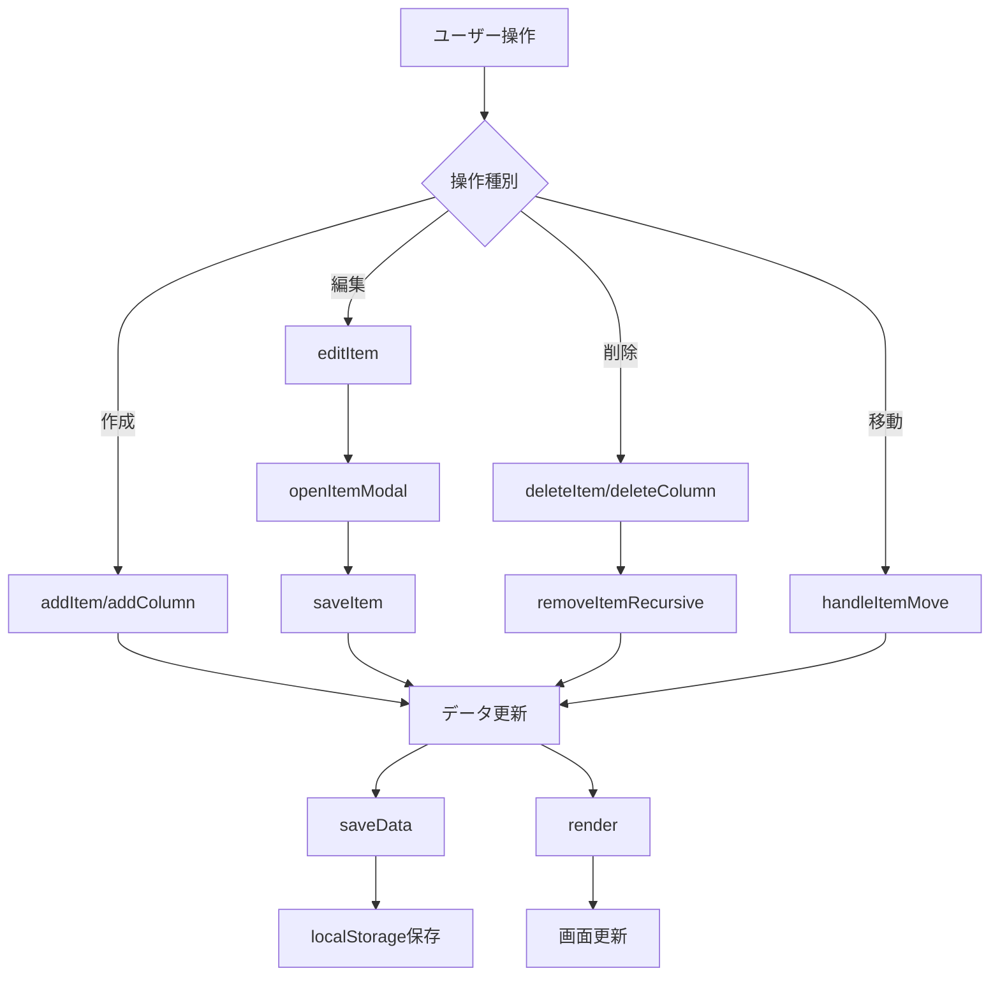
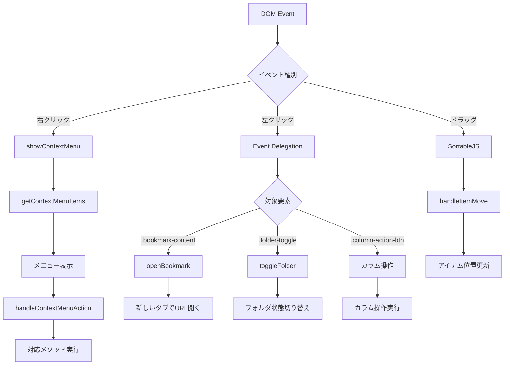

# ブックマークマネージャ v2 - 詳細設計書

## 1. クラス設計

### 1.1 BookmarkManagerクラス

#### 1.1.1 概要
アプリケーション全体を制御するメインクラス。すべての機能を統合管理する。

#### 1.1.2 プロパティ

| プロパティ名 | 型 | 説明 |
|-------------|---|-----|
| data | Object | アプリケーションデータ本体 |
| currentEditingItem | Object | 現在編集中のアイテム情報 |
| currentEditingColumn | String | 現在編集中のカラムID |
| contextMenuTarget | HTMLElement | コンテキストメニュー対象要素 |
| colorPicker | Object | Vanilla Pickerインスタンス |
| selectedIcon | String | 選択中のアイコンクラス名 |
| iconData | Object | アイコンカテゴリデータ |
| columnActionHandler | Function | カラム操作イベントハンドラー |
| folderToggleHandler | Function | フォルダ開閉イベントハンドラー |
| bookmarkClickHandler | Function | ブックマーククリックイベントハンドラー |

#### 1.1.3 メソッド一覧

##### 初期化・ユーティリティ
| メソッド名 | 引数 | 戻り値 | 説明 |
|-----------|-----|-------|------|
| constructor() | - | - | インスタンス初期化 |
| init() | - | void | アプリケーション初期化 |
| generateUUID() | - | String | UUID生成 |
| hexToRgba(hex, opacity) | String, Number | String | HEX色をRGBAに変換 |

##### データ管理
| メソッド名 | 引数 | 戻り値 | 説明 |
|-----------|-----|-------|------|
| loadData() | - | void | localStorageからデータ読み込み |
| saveData() | - | void | localStorageへデータ保存 |
| initializeLibraries() | - | void | 外部ライブラリ初期化 |

##### イベント管理
| メソッド名 | 引数 | 戻り値 | 説明 |
|-----------|-----|-------|------|
| setupEventListeners() | - | void | イベントリスナー設定 |

##### カラム管理
| メソッド名 | 引数 | 戻り値 | 説明 |
|-----------|-----|-------|------|
| addColumn() | - | void | 新しいカラムを追加 |
| deleteColumn(columnId) | String | void | 指定カラムを削除 |

##### アイテム管理
| メソッド名 | 引数 | 戻り値 | 説明 |
|-----------|-----|-------|------|
| findItemById(itemId, items) | String, Array | Object\|null | IDでアイテム検索 |
| addItem(columnId, parentId, type) | String, String, String | void | アイテム追加画面表示 |
| editItem(itemId) | String | void | アイテム編集画面表示 |
| deleteItem(itemId) | String | void | アイテム削除（確認付き） |
| removeItemRecursive(itemId, items) | String, Array | Boolean | 再帰的アイテム削除 |
| toggleFavorite(itemId) | String | void | お気に入り状態切り替え |
| insertItem(itemData) | Object | void | 新規アイテム挿入 |
| updateItem(itemData) | Object | void | 既存アイテム更新 |

##### モーダル管理
| メソッド名 | 引数 | 戻り値 | 説明 |
|-----------|-----|-------|------|
| openItemModal(type) | String | void | アイテム編集モーダル表示 |
| toggleFormFields() | - | void | フォーム表示切り替え |
| initColorPicker() | - | void | カラーピッカー初期化 |
| saveItem() | - | void | アイテム保存処理 |

##### コンテキストメニュー
| メソッド名 | 引数 | 戻り値 | 説明 |
|-----------|-----|-------|------|
| showContextMenu(e) | Event | void | コンテキストメニュー表示 |
| hideContextMenu() | - | void | コンテキストメニュー非表示 |
| getContextMenuItems(target) | HTMLElement | Array | メニュー項目生成 |
| handleContextMenuAction(action) | String | void | メニュー項目実行 |

##### 画面描画
| メソッド名 | 引数 | 戻り値 | 説明 |
|-----------|-----|-------|------|
| render() | - | void | 全体再描画 |
| renderFavorites() | - | void | お気に入りバー描画 |
| renderColumns() | - | void | カラム一覧描画 |
| renderItems(items, level, parentFolderColor) | Array, Number, String | String | アイテム一覧HTML生成 |
| toggleFolder(itemId) | String | void | フォルダ開閉切り替え |
| openBookmark(itemId) | String | void | ブックマークを新しいタブで開く |

##### ソート機能
| メソッド名 | 引数 | 戻り値 | 説明 |
|-----------|-----|-------|------|
| setupSortable() | - | void | ソート機能初期化 |
| setupFavoritesSortable() | - | void | お気に入りソート設定 |
| setupColumnSortable() | - | void | カラム・アイテムソート設定 |
| handleItemMove(evt) | Event | void | アイテム移動処理 |

##### アイコンピッカー
| メソッド名 | 引数 | 戻り値 | 説明 |
|-----------|-----|-------|------|
| getIconData() | - | Object | アイコンカテゴリデータ取得 |
| openIconPicker() | - | void | アイコンピッカー表示 |
| renderIconPicker() | - | void | アイコンピッカー描画 |
| filterIcons() | - | void | アイコンフィルタ処理 |

##### インポート・エクスポート
| メソッド名 | 引数 | 戻り値 | 説明 |
|-----------|-----|-------|------|
| exportData() | - | void | JSONエクスポート |
| importData(event) | Event | void | JSONインポート |
| importChromeBookmarks(event) | Event | void | Chrome HTMLインポート |
| parseChromeBookmarks(doc) | Document | void | Chrome HTML解析 |
| parseBookmarkFolder(dlElement) | HTMLElement | Array | フォルダ解析 |
| parseBookmarkItem(dtElement) | HTMLElement | Object\|null | アイテム解析 |
| getIconFromUrl(url) | String | String | URLからアイコン推定 |

## 2. データフロー設計

### 2.1 データ更新フロー



### 2.2 イベント処理フロー



## 3. ファイル構造詳細

### 3.1 HTML構造（index.html）

```html
<!DOCTYPE html>
<html lang="ja">
<head>
    <!-- メタ情報・CSS・外部ライブラリ -->
</head>
<body>
    <!-- ヘッダー部 -->
    <header class="header">
        <!-- お気に入りバー -->
        <div class="favorites-bar">
            <div class="favorites-list" id="favoritesList">
                <!-- 動的生成：お気に入りアイテム -->
            </div>
        </div>
        
        <!-- 操作ボタン群 -->
        <div class="backup-controls">
            <!-- エクスポート・インポート・ヘルプボタン -->
        </div>
    </header>

    <!-- メインコンテンツ -->
    <main class="main-content">
        <!-- カラムコンテナ -->
        <div class="columns-container" id="columnsContainer">
            <!-- 動的生成：カラム群 -->
        </div>
        
        <!-- カラム追加ボタン -->
        <button class="add-column-btn" id="addColumnBtn">+</button>
    </main>

    <!-- コンテキストメニュー -->
    <div class="context-menu" id="contextMenu">
        <!-- 動的生成：メニュー項目 -->
    </div>

    <!-- モーダル群 -->
    <!-- アイテム編集モーダル -->
    <div class="modal" id="itemModal">...</div>
    
    <!-- ヘルプモーダル -->
    <div class="modal" id="helpModal">...</div>
    
    <!-- アイコンピッカーモーダル -->
    <div class="modal" id="iconPickerModal">...</div>

    <!-- 外部スクリプト読み込み -->
</body>
</html>
```

### 3.2 CSS設計（style.css）

#### セレクタ命名規則
- **BEM記法**: Block__Element--Modifier
- **機能別プレフィックス**: 
  - `.btn-*`: ボタン系
  - `.modal-*`: モーダル系
  - `.help-*`: ヘルプ系
  - `.icon-*`: アイコン系

#### 主要スタイルブロック
```css
/* 1. リセット・ベーススタイル */
* { box-sizing: border-box; }
body { ... }

/* 2. ヘッダー関連 */
.header { ... }
.favorites-bar { ... }
.backup-controls { ... }

/* 3. メインコンテンツ */
.main-content { ... }
.columns-container { ... }

/* 4. カラム・アイテム */
.column { ... }
.tree-item { ... }
.item-content { ... }

/* 5. モーダル */
.modal { ... }
.modal__container { ... }

/* 6. コンテキストメニュー */
.context-menu { ... }

/* 7. ドラッグ&ドロップ */
.sortable-ghost { ... }

/* 8. レスポンシブ */
@media (max-width: 768px) { ... }
```

### 3.3 JavaScript設計（script.js）

#### モジュール構成
```javascript
// ===== メインクラス =====
class BookmarkManager {
    // ===== データ管理 =====
    // データ読み込み・保存関連メソッド
    
    // ===== イベントリスナー設定 =====
    // UI操作に関するイベント設定
    
    // ===== カラム管理 =====
    // カラムの追加・削除・操作
    
    // ===== アイテム管理 =====
    // ブックマーク・フォルダの操作
    
    // ===== モーダル管理 =====
    // 各種モーダルの表示制御
    
    // ===== 画面描画 =====
    // DOM更新・HTML生成
    
    // ===== ソート機能 =====
    // ドラッグ&ドロップ処理
    
    // ===== インポート・エクスポート =====
    // データの入出力処理
}

// ===== アプリケーション初期化 =====
// DOMContentLoaded時の処理
```

## 4. 状態管理

### 4.1 アプリケーション状態

#### グローバル状態
```javascript
{
  // 永続化データ（localStorage）
  data: {
    appSettings: {},        // 設定情報
    columns: [...],         // カラムデータ
    columnOrder: [...],     // カラム順序
    favoritesOrder: [...]   // お気に入り順序
  },
  
  // 一時状態（メモリ上）
  currentEditingItem: null,     // 編集中アイテム
  currentEditingColumn: null,   // 編集中カラム
  contextMenuTarget: null,      // 右クリック対象
  selectedIcon: "fas fa-bookmark" // 選択アイコン
}
```

#### 状態変更フロー
1. **ユーザー操作** → **イベントハンドラー**
2. **データ更新** → **saveData()**（即座にlocalStorage保存）
3. **render()** → **画面更新**

### 4.2 イベント管理

#### Event Delegation パターン
```javascript
// 従来の方式（問題あり）
document.querySelectorAll('.button').forEach(btn => {
    btn.addEventListener('click', handler); // 重複登録の可能性
});

// Event Delegation（採用方式）
document.addEventListener('click', (e) => {
    const btn = e.target.closest('.button');
    if (btn) {
        handler(e);
    }
});
```

## 5. エラーハンドリング

### 5.1 エラー種別と対応

| エラー種別 | 発生場所 | 対応方法 |
|-----------|---------|---------|
| localStorage容量超過 | saveData() | アラート表示 |
| JSON解析エラー | loadData() | 初期データで復旧 |
| ファイル読み込みエラー | importData() | エラーメッセージ表示 |
| DOM要素未発見 | 各種操作 | null チェック |
| 不正なUUID | findItemById() | null 返却 |

### 5.2 エラーハンドリングパターン
```javascript
// データ保存時
saveData() {
    try {
        localStorage.setItem('bookmarkManager', JSON.stringify(this.data));
    } catch (error) {
        alert('データの保存に失敗しました。ストレージ容量を確認してください。');
    }
}

// ファイル読み込み時
importData(event) {
    try {
        const importedData = JSON.parse(e.target.result);
        // 処理継続
    } catch (error) {
        alert('ファイルの読み込みに失敗しました。');
    }
}
```

## 6. パフォーマンス最適化

### 6.1 レンダリング最適化

#### 最小限の再描画
```javascript
// 全体再描画（重い）
render() {
    this.renderFavorites();
    this.renderColumns();
    this.setupSortable();
}

// 部分更新（軽い）
toggleFolder(itemId) {
    // フォルダ状態のみ更新
    const item = this.findItemById(itemId);
    item.collapsed = !item.collapsed;
    this.saveData();
    this.renderColumns(); // 必要な部分のみ
}
```

#### Event Delegation による効率化
- 大量の要素に個別のイベントリスナーを設定せず
- 親要素で一括処理することでメモリ使用量を削減

### 6.2 メモリ管理

#### イベントリスナーのクリーンアップ
```javascript
renderColumns() {
    // 既存ハンドラーを削除
    if (this.columnActionHandler) {
        document.removeEventListener('click', this.columnActionHandler);
    }
    
    // 新しいハンドラーを設定
    this.columnActionHandler = (e) => { /* 処理 */ };
    document.addEventListener('click', this.columnActionHandler);
}
```

## 7. セキュリティ考慮事項

### 7.1 XSS対策
```javascript
// 危険な例
element.innerHTML = userInput; // XSS脆弱性

// 安全な例
element.textContent = userInput; // テキストとして扱う
// または
element.innerHTML = escapeHtml(userInput); // エスケープ処理
```

### 7.2 URL検証
```javascript
// URL形式チェック
function isValidUrl(string) {
    try {
        new URL(string);
        return true;
    } catch (_) {
        return false;
    }
}
```

### 7.3 データサニタイゼーション
- HTML特殊文字のエスケープ
- JavaScriptコードの実行防止
- ファイル読み込み時の形式チェック

## 8. 今後の拡張可能性

### 8.1 機能拡張ポイント
1. **タグ機能**: ブックマークへのタグ付け
2. **検索機能**: 全文検索・タグ検索
3. **共有機能**: エクスポートデータの共有URL生成
4. **テーマ機能**: ダーク・ライトテーマ切り替え
5. **ショートカットキー**: キーボード操作サポート

### 8.2 技術的拡張
1. **PWA化**: Service Worker、オフライン対応
2. **バックエンド連携**: サーバーサイド同期
3. **ブラウザ拡張**: Chrome Extension化
4. **モバイルアプリ**: Cordova/Capacitor変換

### 8.3 アーキテクチャ改善
1. **状態管理ライブラリ**: Redux/Vuex導入
2. **コンポーネント化**: React/Vue.js移行
3. **TypeScript化**: 型安全性の向上
4. **テスト導入**: Jest/Cypress等での自動テスト